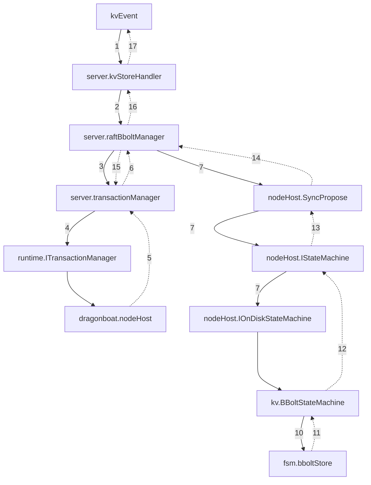

## KV Store Runtime Architecture v2
---
This is the general architecture of the KVStore, which is the core monolithic key-value architecture that underpins Pleiades.
## Interface
The most up-to-date interfaces can be found in the code base, but here is the general interface structure. It includes two major features: transactions and kv operations. Transactions are atomic (by design), and are currently implicit due to the disk-based state machine implementation with bbolt.
```go
type ITransactionManager interface {
	CloseTransaction(ctx context.Context, transaction *kvpb.Transaction) error
	Commit(ctx context.Context, transaction *kvpb.Transaction) *kvpb.Transaction
	GetNoOpTransaction(shardId uint64) *kvpb.Transaction
	GetTransaction(ctx context.Context, shardId uint64) (*kvpb.Transaction, error)
	SessionFromClientId(clientId uint64) (*dclient.Session, bool)
}
type IKVStore interface {
	CreateAccount(request *kvpb.CreateAccountRequest) (*kvpb.CreateAccountResponse, error)
	DeleteAccount(request *kvpb.DeleteAccountRequest) (*kvpb.DeleteAccountResponse, error)
	CreateBucket(request *kvpb.CreateBucketRequest) (*kvpb.CreateBucketResponse, error)
	DeleteBucket(request *kvpb.DeleteBucketRequest) (*kvpb.DeleteBucketResponse, error)
	GetKey(request *kvpb.GetKeyRequest) (*kvpb.GetKeyResponse, error)
	PutKey(request *kvpb.PutKeyRequest) (*kvpb.PutKeyResponse, error)
	DeleteKey(request *kvpb.DeleteKeyRequest) (*kvpb.DeleteKeyResponse, error)
}
```
This isn't a perfectly ideal interface, but it's a good starting point. Once the transactions interface is properly implemented, it will be more effective.
### Hot Path
This is a high-level architecture of the hot path for kv operations. Kv operations **must** be as performant as possible as every higher-order use case will be built on the kvstore and be wholly reliant on it's performance.

> **Note:** *This diagram assumes a raft shard has been properly provisioned and is known in advance. Check out [shard lifecycles](lifecycles-v2.md#Shards) for more information*


1. A `kvEvent` occurs. Currently these happen through the [Connect](https://connectrpc.com/) functionality using protobufs. Here are the current interface options that could happen
2. Once the `kvEvent` occurs, it's handled by the `kvStoreHandler` in the `server` package. This layer is currently just a wrapper so it exists.
3. A local transaction is requested, but is currently not implemented.
4. The interface is called, but is backed by `dragonboat.NodeHost`
5. The transaction, if applicable, is bubbled up and stored in the transaction manager's local cache.
6. The cached version is returned to the `raftBboltStoreManager`, which is just a packaging wrapper
7. The event is sent through the synchronous interface of `dragonboat.NodeHost.SyncPropose`, and it's repackaged as a byte array. While mildly inconvenient, it's useful as we can pass anything through this layer with minimal concerns.
8. 