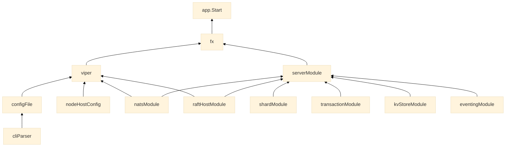

## Server Bootstrap Architecture v1

```mermaid
---
Server Startup Architecture
---
%%{init: { 'logLevel': 'debug', 'theme': 'base', 'gitGraph': {'showBranches': true, 'showCommitLabel':true,'mainBranchName': 'Bee'}} }%%
graph BT
    cliParser --> configFile --> viper --> fx
    nodeHostConfig --> viper
    natsModule --> viper
    natsModule --> serverModule
    raftHostModule --> viper
    shardModule --> serverModule
    transactionModule --> serverModule
    raftHostModule --> serverModule
    kvStoreModule --> serverModule
    eventingModule --> serverModule
    serverModule --> fx
    fx --> app.Start
```
