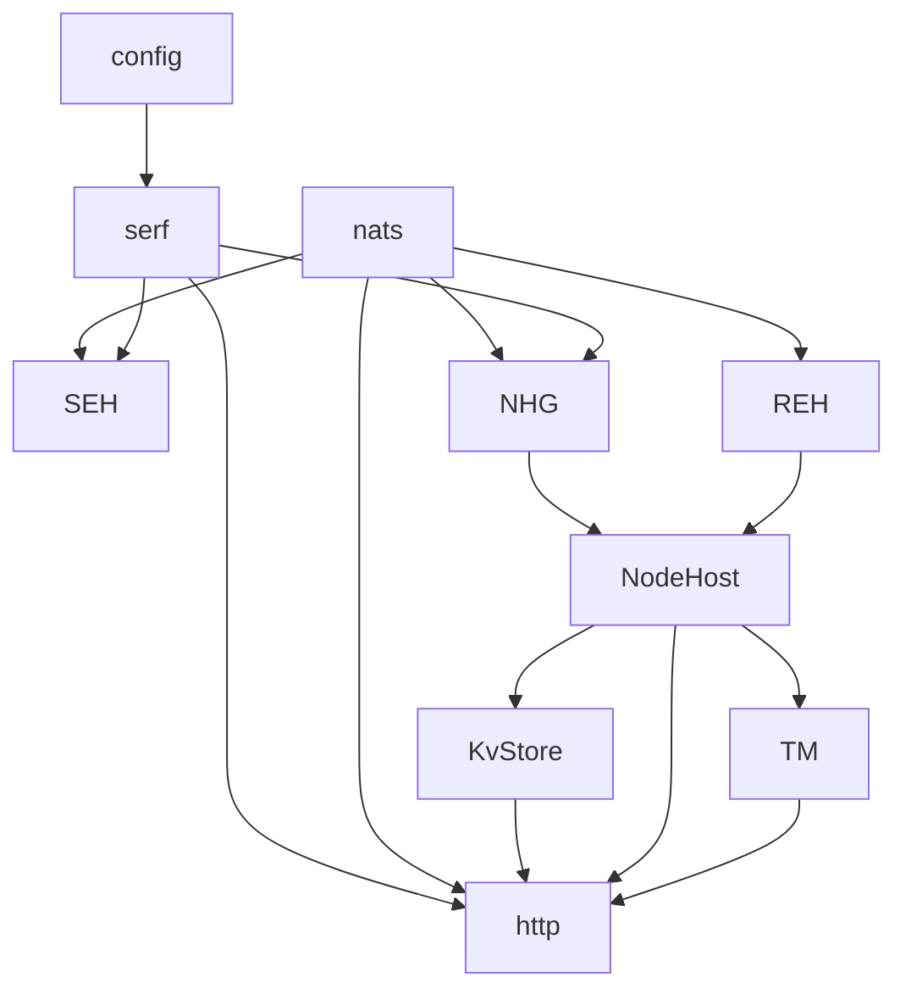
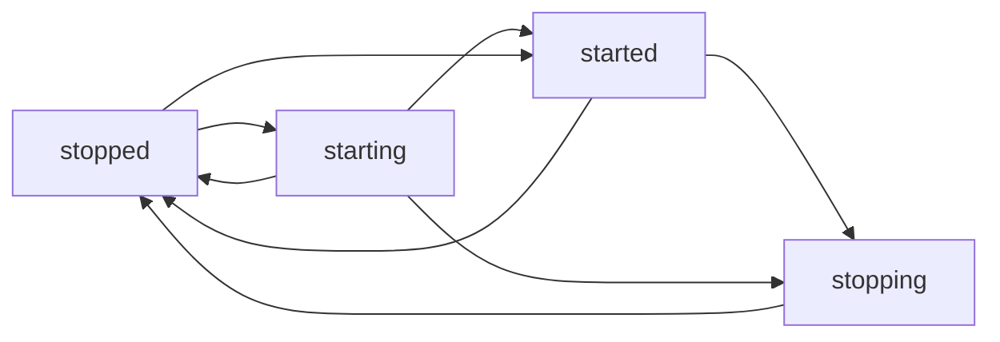

- Feature Name: service_graph
- Status: declined
- Start Date: 2023-06-09
- Authors: @mxplusb
- RFC PR: #19 #20
- Issue: #18

_[This RFC was declined due to too much added complexity]_

# Summary

This proposal recommends an internal service graph be created and introduced into the Pleiades runtime layer. This is needed because the internal app framework currently in use, fx, has reached the end of its capabilities and suitability for Pleiades. The internal service graph would be a DAG implementation in the configuration package designed to make it easy to configure, resolve, and run internal service interdependencies. The impact will affect the entire runtime layer because it will restructure and remap how service connectedness works. This implementation should allow Pleiades to start to grow its internals at different paces without breaking any isolation requirements.

# Motivation

**Audience:** Pleiades Contributors and System Operators

The primary motivation behind using a service graph to resolve service dependencies is to address the core architectural needs of Pleiades. The internal structure of a Pleiades node is highly complex and relational, not hierarchial. The complexity of this internal structure is handled through an internal message bus, so relationships are modeled through events, but it still leaves a lot of challenges when dealing with booting a node, safely shutting down a node, and restarting failed processed remotely. By implementing a service graph, Pleiades will be able to scale its internal process architecture to meet any size or complexity needs without creating unmaintainable architectures.

# Technical design

**Audience:** Pleiades Contributors

The technical implementation of the service graph is a directed, acyclic graph (DAG). DAGs are used everywhere, and are the underlying models for workflow models in nearly every workflow engine. DAGs can also be used to represent dependency trees and model dependency injection requirements, which is the use case for Pleiades. This diagram is an example of some process interdependencies represented as a DAG.



At the time of the proposal, this is what the current state of an app framework looks like:

```go
app := fx.New(
    fx.Provide(func() *viper.Viper {
        return config
    }),
    fx.Provide(func() dconfig.NodeHostConfig {
        nhc := dconfig.NodeHostConfig{
            DeploymentID:   config.GetUint64("server.host.deployment-id"),
            WALDir:         logDir,
            NodeHostDir:    dataDir,
            RTTMillisecond: config.GetUint64("server.host.rtt"),
            ListenAddress:  nodeAddr,
            RaftAddress:    raftAddr,
            EnableMetrics:  true,
            NotifyCommit:   config.GetBool("server.host.notifyCommit"),
        }

        certFile := config.GetString("tls.cert-file")
        keyFile := config.GetString("tls.key-file")
        caFile := config.GetString("tls.ca-cert-file")

        if certFile != "" && keyFile != "" && caFile != "" {
            nhc.MutualTLS = true
            nhc.CAFile = caFile
            nhc.CertFile = certFile
            nhc.KeyFile = keyFile
        }
        return nhc
    }),
    fx.Provide(func() zerolog.Logger { // the generalized logger
        return logger
    }),
    fx.WithLogger(func() fxevent.Logger { // this provides the fx logger, not the general logger
        return zerologAdapter{logger}
    }),
    fx.Provide(eventing.NewServer),
    fx.Provide(server.NewHttpServeMux),
    fx.Provide(server.NewNodeHost),
    fx.Provide(server.NewHttpServer),
    fx.Provide(eventing.NewPubSubClient),
    fx.Provide(eventing.NewStreamClient),
    fx.Provide(eventing.NewLifecycleManager),
    fx.Provide(kvstore.NewBboltStoreManager),
    fx.Provide(server.AsRoute(kvstore.NewKvstoreBboltConnectAdapter)),
    fx.Provide(server.AsRoute(kvstore.NewKvstoreTransactionConnectAdapter)),
    fx.Provide(raft.NewHost),
    fx.Provide(server.AsRoute(raft.NewRaftHostConnectAdapter)),
    fx.Provide(server.AsRoute(shard.NewRaftShardConnectAdapter)),
    fx.Provide(shard.NewManager),
    fx.Provide(transactions.NewManager)
    fx.Invoke(eventing.NewLifecycleManager),
    fx.Invoke(server.NewHttpServer),
)

if err := app.Start(ctx); err != nil {
    logger.Fatal().Err(err).Msg("can't start services")
}
```

Because Pleiades currently uses [`fx`](https://github.com/uber-go/fx) for the service dependency mappings, it's led to a mess of logic that's been interspersed throughout the processes and singletons. `fx` only handles lazy initialization for the constructors, which means that services can't easily or independently be started to properly resolve the dependencies. The underlying dependency injection framework, [`dig`](https://pkg.go.dev/go.uber.org/dig), for `fx` is useful, but it's also missing some core features, such as booting or shutting down a system. The service graph design aims to solve this problem and be scalable for many years.

Initially, the underlying DAG will be provided by the [`dag`](https://pkg.go.dev/github.com/heimdalr/dag) library. While introducing more dependencies is risky, the benefits of using a tried and tested DAG outweigh the supply chain concerns. The service graph functionality will be built on top `dag`, with some useful features from `dig` being included.

The service graph will meet these core requirements:
1. Resolving a service and its dependencies is independent of it's lifecycle
2. Starting a service will resolve and start all of its dependent services
3. Stopping a service will resolve may shut down all of its parent services
4. Service configurations must be functionally separate from the service
5. Services can implement an interface to participate in the start/stop lifecycle
6. The service graph will implement a lifecycle

To support lifecycle requirements, the service graph should contain these lifecycle definitions:
* Stopped
* Starting
* Started
* Stopping

The lifecycle state transitions will look like this:



This set of state transitions will allow for implementing services to be truthful when interrogated, but also keep the design flexible enough to be representative of the state. To support the service states, an `IHostedService` interface must be created, and is defined like so:

```go
type IHostedService interface {
	dag.IDInterface
	Start(ctx context.Context) error
	Stop(ctx context.Context) error
	LifecycleState() LifecycleState
}
```

`IHostedService` embeds `dag.IDInterface` so services can define their own service identifier - this also makes it easier for debugging. The service graph should contain these core methods:
* `AddOption[T ~struct](opt T) error`
* `RemoveOption[T ~struct](opt T) error`
* `RegisterService[T IHostedService](svc T) error`
* `UnregisterService[T IHostedService](svc T) error`
* `ResolveService[T IHostedService](id string) T`
* `StartService(id string) error`
* `StopService(id string) error`
* `Boot() error`
* `Shutdown() error`

These methods provide the core functionality required for scalable service management across the code base, and don't necessarily require developers to have to care too much about the internals. A key functional requirement is the ability to resolve a service, regardless of its state. While dependency injection is only targeted for service graph members, this functionality would allow for dependency injection outside the service graph at a later time.

## Drawbacks

The first drawback is the need for this to exist. Several frameworks were tried, but none solved the problem effectively. This is also an incredibly complex solution for a (currently) small problem, and is generally overkill for the current state of Pleiades. It also introduces systemic complexity, a third party library, and increases the maintenance load of contributors.

## Rationale and Alternatives

The current spaghetti code problem is only small because development can't safely progress. There are a couple different ways to solve this problem, through `fx` and `dig`, but none really solve the problem the way Pleiades needs. This problem will only continue to grow in scale as Pleiades continues to evolve, and this approach, while heavy handed, will prevent this problem from occurring in the future.

# Explain it to folk outside your team

**Audience:** PMs, doc writers, end-users, Pleiades contributors in other areas of the project

This change enables better lifecycle management for Pleiades' internal services, enables a better isolation between dependencies, and will allow the code base to continue to evolve without increasing development overhead. Designing and integrating new services into Pleiades will be very straightforward, and should drastically decrease SDLC cycle times for those work streams.

# Unresolved questions

Audience: all participants to the RFC review.

Is there a more efficient, less complex solution to this problem?
